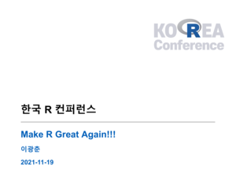
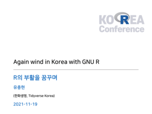
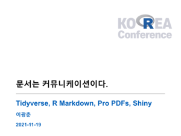
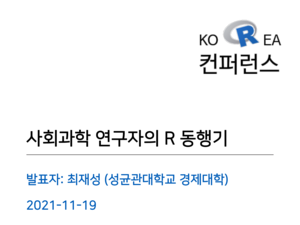
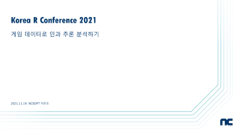
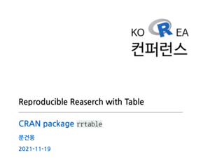
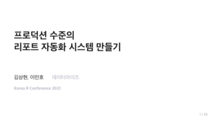
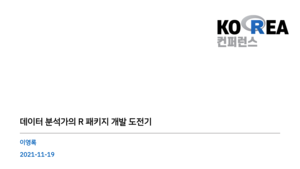
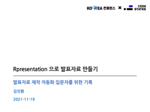

```{r setup, include=FALSE}
knitr::opts_chunk$set(echo = FALSE)
```

# Keynote

```{r get-first-page, eval = FALSE, echo = FALSE}
# PDF 발표자료에서 Thumbnail 제작하기 !!!
library(tidyverse)
library(magick)
library(pdftools)

pdf_files <- fs::dir_ls("data/pdf/", glob = "*.pdf")
png_files <- fs::path_file(pdf_files) %>% tools::file_path_sans_ext(.)

extract_first_pdf_page <- function(pdf_filename, png_filename) {
  
  one_pdf <- magick::image_read_pdf(pdf_filename, pages = 1) %>% 
    image_resize(geometry = "300x400")
  
  png_filename_ascii <- stringi::stri_trans_general(png_filename, "Hangul-Latin")
  
  one_pdf %>% 
    magick::image_write(glue::glue("data/slides_png/{png_filename_ascii}.png"), format = "png")
}

walk2(pdf_files, png_files, extract_first_pdf_page)
```

+:-----------------------------------:+:--------------------------------------------------------:+:----------------------------------------:+
| 이광춘                              | Julia Silge                                              | 유충현                                   |
+-------------------------------------+----------------------------------------------------------+------------------------------------------+
| ### **오프닝**                      | ### **Creating features for machine learning from text** | ### **Again wind in Korea with GNU R**   |
+-------------------------------------+----------------------------------------------------------+------------------------------------------+
|  |                         |  |
+-------------------------------------+----------------------------------------------------------+------------------------------------------+

# 실시간 라이브

+---------------------------------------+------------------------------------------+---------------------------------------+----------------------------------------------------+
| 이광춘                                | 최재성                                   | 이준혁                                | 윤화영 외                                          |
+---------------------------------------+------------------------------------------+---------------------------------------+----------------------------------------------------+
| ### **결국 문서는 커뮤니케이션이다**  | ### **사회과학 연구자의 R 동행기**       | ### **Infinite Shiny World**          | ### **Digital Divide Solution - 오픈 통계 팩키지** |
+---------------------------------------+------------------------------------------+---------------------------------------+----------------------------------------------------+
|  |  |  |             |
+---------------------------------------+------------------------------------------+---------------------------------------+----------------------------------------------------+

------------------------------------------------------------------------

+------------------------------------------+-----------------------------------------+-----------------------------------------------------------+---+
| 이은조                                   | 이남신                                  | 박성우                                                    |   |
+------------------------------------------+-----------------------------------------+-----------------------------------------------------------+---+
| ### **게임 데이터로 인과 추론 분석하기** | ### **실제 기업 서비스에서 R 활용하기** | ### **데이터 옵스의 시작 데이터사이언스캔버스와 그 활용** |   |
+------------------------------------------+-----------------------------------------+-----------------------------------------------------------+---+
|        |  |                     |   |
+------------------------------------------+-----------------------------------------+-----------------------------------------------------------+---+

# 동영상 녹화

+------------------------------------------+-----------------------------------------------------+---------------------------------------------------+------------------------------------------------+
| 문건웅                                   | 이민호/김상현                                       | 이혜선                                            | 황의찬                                         |
+------------------------------------------+-----------------------------------------------------+---------------------------------------------------+------------------------------------------------+
| ### **Reproducible Research with Table** | ### **프로덕션 수준의 리포트 자동화 시스템 만들기** | ### **데이터사이언스와 오픈소스**                 | ### **납세자의 정서가 조세정책에 미치는 영향** |
+------------------------------------------+-----------------------------------------------------+---------------------------------------------------+------------------------------------------------+
|    |       | {width="300"} |         |
+------------------------------------------+-----------------------------------------------------+---------------------------------------------------+------------------------------------------------+

+----------------------------------------------+--------------------------------------------+--------------------------------------------------------+---+
| 이영록                                       | 김진환                                     | 박상훈                                                 |   |
+----------------------------------------------+--------------------------------------------+--------------------------------------------------------+---+
| ### **데이터 분석가의 R 패키지 개발 경험기** | ### **Rpresentation 으로 발표자료 만들기** | ### **재현가능한 연구를 위한 노력: R과 정치학의 만남** |   |
+----------------------------------------------+--------------------------------------------+--------------------------------------------------------+---+
|          |       |                   |   |
+----------------------------------------------+--------------------------------------------+--------------------------------------------------------+---+
