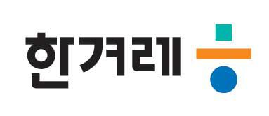

```{r setup, include=FALSE}
knitr::opts_chunk$set(echo = FALSE)

```

# Date and Location

1.  Date: 2021년 11월 19일(금) 10:00 \~ 17:00
2.  Location: [롯데월드타워 35층 원티드랩]((https://www.lwt.co.kr/en/main/main.do)) (서울 송파구 올림픽로 300)

# News

-   [2021-07-04] 유충현 Keynote 발표 수락 !!!

    -   {width="98" height="92"}

-   [2021-07-02] `useR 2021 Korea` 웹사이트 Hands-on 코딩 !!!

    -   [festa 이벤트](https://festa.io/events/1653)

-   [2021-07-01] `Julia Silge` Keynote 발표 수락 !!!

    -   {width="98" height="92"}

-   [2021-06-30] `useR 2021 Korea` 컨퍼런스 포스터 초안 준비

    -   [`poster` 브랜치](https://github.com/tidyverse-korea/rconf/tree/poster)

-   [2021-06-22] 제이펍 스폰서

    -   {width="159" height="85"}

-   [2021-06-20] `useR 2021 Korea` 로고 제작:

    -   {width="119" height="117"}

-   [2021-06-19] `useR 2021 Korea` 장소 섭외 중 (Open UP 등)

-   [2021-06-15] R 컨퍼런스 명칭 확정: `useR 2021 Korea`

-   [2021-06-10] R 컨퍼런스 일시 확정: 11월 19일

# Sponsors

-   Platinum

-   Gold

-   Silver

-   Bronze

    -   [{width="30%"}](https://www.oss.kr/)

-   Violet

    -   [{width="159" height="85"}](https://jpub.tistory.com/)

-   Media

    - [{width="350"}](https://www.hani.co.kr/)

# SNS

R is an open source software and programming language for data ingestion, data processing, exploratory data analysis, statistical modeling, visualization and machine learning among other things. The [**Tidyverse Seoul R meetup**](https://www.meetup.com/seoul-r-meetup) brings together local users of R and featuring talks with world-class speakers while creating fruitful networking opportunities for its members.

-   Global R Meetup: [link](https://benubah.github.io/r-community-explorer/rugs.html)
-   Tidyverse Seoul R Meetup: [link](https://tidyverse-korea.github.io/seoul-R/)
-   Youtube Channel: [link](https://www.youtube.com/channel/UCW-epmIvjBEhhVXw_F0Nqbw)
-   Facebook Group: [link](https://www.facebook.com/groups/tidyverse)
-   **Seoul R Meetup**: [link](https://www.meetup.com/seoul-r-meetup)
-   Shiny Seoul Meetup: [link](https://github.com/shinykorea/Meetup)
