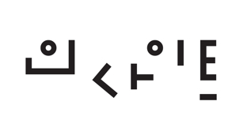
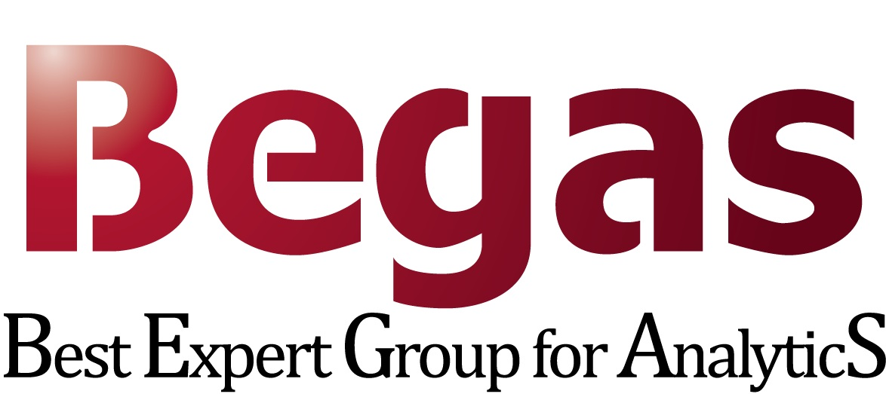

```{r setup, include=FALSE}
knitr::opts_chunk$set(echo = FALSE)

```

# Date and Location

1.  Date: 2021년 11월 19일(금) 10:00 \~ 17:00

2.  Location: 온라인 라이브

    -   연사분 촬영장소: [롯데월드타워 35층 원티드랩](https://www.lwt.co.kr/en/main/main.do) (서울 송파구 올림픽로 300)

# News

-   [2021-08-18] 도서출판 인사이트 스폰서 확정

    -   {width="185" height="101"}
    
-   [2021-08-17] R 마크다운 책(전자책) 제작 Hands-On 워크샵이 있습니다.

    -   [한국 R 컨퍼런스 - 전자책 제작 Hands-On 신청](https://festa.io/events/1726)
    
-   **[2021-08-08] 한국 R 컨퍼런스 발표자 모집 마감일(8월30일) 준수해 주세요.**

    -   [발표 신청](https://victorlee5.typeform.com/to/EJK7aEva)

-   [2021-08-08] 발표자료(a.k.a. 파워포인즈 PPT) 제작 Hands-On 워크샵이 있습니다.

    -   [한국 R 컨퍼런스 - 핸즈온 참가 신청](https://festa.io/events/1726)

-   [2021-08-03] 베가스 후원 및 박성우 연구원님 발표 수락 !!!

    -   {width="188"}

-   [2021-07-26] 한국 R 컨퍼런스 발표자 템플릿 초안 공개합니다!!!

    -   [발표자 템플릿](https://github.com/tidyverse-korea/templates)

-   [2021-08-06] R 마크다운 이력서 제작 Hands-On 워크샵이 있습니다.

    -   [한국 R 컨퍼런스 - 이력서 제작 Hands-On 신청](https://festa.io/events/1707)

-   [2021-07-20] 한국 R 컨퍼런스 명칭과 로고 변경

    -   {width="40%"}

-   [2021-07-16] R Consortium 후원 확정

    -   [{width="36%"}](https://www.r-consortium.org/)

-   [2021-07-15] useR! 2021 Korea 컨퍼런스 발표자 모집 시작합니다.

    -   [발표 신청](https://victorlee5.typeform.com/to/EJK7aEva)

-   [2021-07-23] R 마크다운 명함 제작 Hands-On 워크샵이 있습니다.

    -   [useR! 2021 Korea - 명함제작 신청](https://festa.io/events/1679)

-   [2021-07-10] "R 사용자회" 행동 규범(Code of Conduct) 함께 작성했습니다.

-   [2021-07-09] R 컨퍼런스 포스터 제작 Hands-On 워크샵이 있습니다.

    -   [useR! 2021 Korea - R 컨퍼런스 포스터 제작 Hands-On 신청](https://festa.io/events/1666)

-   [2021-07-07] 데이터야놀자 커뮤니티가 함께 합니다.

    -   {width="282"}

-   [2021-07-04] 유충현 Keynote 발표 수락 !!!

    -   {width="98" height="92"}

-   [2021-07-02] `useR 2021 Korea` 웹사이트 Hands-on 코딩 !!!

    -   [festa 이벤트](https://festa.io/events/1653)

-   [2021-07-01] `Julia Silge` Keynote 발표 수락 !!!

    -   {width="98" height="92"}

-   [2021-06-30] `useR 2021 Korea` 컨퍼런스 포스터 초안 준비

    -   [`poster` 브랜치](https://github.com/tidyverse-korea/rconf/tree/poster)

-   [2021-06-22] 제이펍 스폰서

    -   {width="159" height="85"}

-   [2021-06-20] `useR 2021 Korea` 로고 제작:

    -   {width="119" height="117"}

-   [2021-06-19] `useR 2021 Korea` 장소 섭외 중 (Open UP 등)

-   [2021-06-15] R 컨퍼런스 명칭 확정: `useR 2021 Korea`

-   [2021-06-10] R 컨퍼런스 일시 확정: 11월 19일
