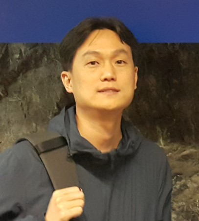

```{r setup, include=FALSE}
knitr::opts_chunk$set(echo = FALSE)

# 데이터라이즈 발표자 2명 --> 이미지 하나로 만들기 
# library(tidyverse)
# library(magick)
# 
# sanghyun_img <- image_read("fig/speakers/kimsanghyun.jpg")
# minho_img <- image_read("fig/speakers/leeminho.jpg")
# 
# image_join(c(minho_img, sanghyun_img)) %>% 
#   image_animate(fps=1) %>% 
#   image_write("fig/speakers/datarize.gif")
```

# 키노트 발표

+-------------------------------------------------------------------------------------------------------------------------------------------------------------------------------------------------------------------------------------------------------------------------------------------------------------------------------------------------------------------------------------+------------------------------------------------------------------------------------------------------------------------------------------------------------------------------------------------------------------------------------------------------------------------------------------------------------------------------------------------------------------------------------------------------------------------------------------------------------------------------------------------------------------------------------------------------------------------------------------------------------------------------------------------------+
| [쥴리아 실기(Julia Silge)](https://juliasilge.com/)                                                                                                                                                                                                                                                                                                                                 | 유충현                                                                                                                                                                                                                                                                                                                                                                                                                                                                                                                                                                                                                                               |
+-------------------------------------------------------------------------------------------------------------------------------------------------------------------------------------------------------------------------------------------------------------------------------------------------------------------------------------------------------------------------------------+------------------------------------------------------------------------------------------------------------------------------------------------------------------------------------------------------------------------------------------------------------------------------------------------------------------------------------------------------------------------------------------------------------------------------------------------------------------------------------------------------------------------------------------------------------------------------------------------------------------------------------------------------+
| {width="300"}                                                                                                                                                                                                                                                                                                                                               | {width="274"}                                                                                                                                                                                                                                                                                                                                                                                                                                                                                                                                                                                                             |
+-------------------------------------------------------------------------------------------------------------------------------------------------------------------------------------------------------------------------------------------------------------------------------------------------------------------------------------------------------------------------------------+------------------------------------------------------------------------------------------------------------------------------------------------------------------------------------------------------------------------------------------------------------------------------------------------------------------------------------------------------------------------------------------------------------------------------------------------------------------------------------------------------------------------------------------------------------------------------------------------------------------------------------------------------+
| Julia Silge is a data scientist and software engineer at RStudio PBC where she works on open source modeling tools. She is an author, an international keynote speaker, and a real-world practitioner focusing on data analysis and machine learning practice. Julia loves text analysis, making beautiful charts, and communicating about technical topics with diverse audiences. | Korea R User Group 창설을 주도하셨고 초대 대표 역임하셨으며 2011년, 2012년 1회/2회 Korea R User Conference를 이끄셨고, ["R을 이용한 통계학의 이해"](http://www.yes24.com/Product/Goods/8920562) 외 5종 저술을 통해 한글 R/Tidyverse 대중화에 크게 기여를 하셨으며, CRAN에 R 팩키지 [`dlookr`](https://cran.r-project.org/web/packages/dlookr/index.html), [`alookr`](https://cran.r-project.org/web/packages/alookr/index.html) 를 기여하였다. 현재는 [Seoul R Meetup](https://tidyverse-korea.github.io/seoul-R/), [Tidyverse Korea](https://www.facebook.com/groups/tidyverse) 운영위원으로 R/Tidyverse 보급과 선진화에 헌신적인 기여를 하고 있다. |
+-------------------------------------------------------------------------------------------------------------------------------------------------------------------------------------------------------------------------------------------------------------------------------------------------------------------------------------------------------------------------------------+------------------------------------------------------------------------------------------------------------------------------------------------------------------------------------------------------------------------------------------------------------------------------------------------------------------------------------------------------------------------------------------------------------------------------------------------------------------------------------------------------------------------------------------------------------------------------------------------------------------------------------------------------+

# 발표

+------------------------------------------------------------------------+--------------------------------------------------+-------------------------------------------------------------------------------------------------------------------------------------------------------------------------------------------------------------------------------------------------------------------------------------------------------------------------------------------------+
| 발표자                                                                 | 사진                                             | 발표                                                                                                                                                                                                                                                                                                                                            |
+:======================================================================:+:================================================:+:================================================================================================================================================================================================================================================================================================================================================+
| [이광춘](https://education.rstudio.com/trainers/people/lee+kwangchun/) | {width="100"} | -   결국 문서는 커뮤니케이션이다: OCR, MRC, R 마크다운, 그리고 데이터.                                                                                                                                                                                                                                                                          |
|                                                                        |                                                  |                                                                                                                                                                                                                                                                                                                                                 |
|                                                                        |                                                  | -   문서를 데이터로 프로그래밍 언어는 R 마크다운을 활용하여 증거기반 의사결정을 위한 End-to-End 데이터 과학 제품 개발                                                                                                                                                                                                                           |
+------------------------------------------------------------------------+--------------------------------------------------+-------------------------------------------------------------------------------------------------------------------------------------------------------------------------------------------------------------------------------------------------------------------------------------------------------------------------------------------------+
| 어수행                                                                 | {width="100"}  | -   수요예측? Forecasting? 우리는 답을 찾을 것이다. 늘 그랬듯이... (정말?)                                                                                                                                                                                                                                                                      |
|                                                                        |                                                  |                                                                                                                                                                                                                                                                                                                                                 |
|                                                                        |                                                  | -   Forecasting 모형개발 삽질기                                                                                                                                                                                                                                                                                                                 |
+------------------------------------------------------------------------+--------------------------------------------------+-------------------------------------------------------------------------------------------------------------------------------------------------------------------------------------------------------------------------------------------------------------------------------------------------------------------------------------------------+
| 최재성                                                                 | {width="100"}  | -   사회과학 연구자의 R 동행기                                                                                                                                                                                                                                                                                                                  |
|                                                                        |                                                  |                                                                                                                                                                                                                                                                                                                                                 |
| 성균관 글로벌경제                                                      |                                                  | -   대학에서 데이터 분석을 가르치고 사회과학 분야에서 실증 연구를 업으로 삼고 있는 사람은 왜 R에 관심을 가지게 되었고, 무엇을 익혔고, 어떤 일을 해왔을까? 사회과학 연구의 도구로서 R의 다양한 활용 가능성에 대한 생각을 나누어본다.                                                                                                             |
+------------------------------------------------------------------------+--------------------------------------------------+-------------------------------------------------------------------------------------------------------------------------------------------------------------------------------------------------------------------------------------------------------------------------------------------------------------------------------------------------+
| 박상훈                                                                 | {width="100"} | -   재현가능한 연구를 위한 노력: R과 정치학의 만남                                                                                                                                                                                                                                                                                              |
|                                                                        |                                                  |                                                                                                                                                                                                                                                                                                                                                 |
| University of South Carolina                                           |                                                  | -   다른 사회과학 분과들과 마찬가지로 정치학 역시 데이터 분석에 대한 중요성이 강조되어 왔다. 학부에서 SPSS, 대학원 석사과정에서 STATA, 그리고 박사과정에 들어서 R을 접하게 된 경험을 바탕으로 R이 정치학 연구에서 어떻게 자리잡아 왔으며,앞으로 어떻게 자리잡아 갈 것인지, R을 활용한 연구 과정에서 겪은 어려움 등에 대한 단상을 나누고자 한다. |
+------------------------------------------------------------------------+--------------------------------------------------+-------------------------------------------------------------------------------------------------------------------------------------------------------------------------------------------------------------------------------------------------------------------------------------------------------------------------------------------------+
| 이민호/김상현                                                          | {width="100"}      | -   프로덕션 수준의 리포트 자동화 시스템 만들기                                                                                                                                                                                                                                                                                                 |
|                                                                        |                                                  |                                                                                                                                                                                                                                                                                                                                                 |
| [데이터라이즈](https://www.datarize.ai/)                               |                                                  | -   다양한 고객사 요구사항에 유연하게 대응하기 위한 리포트 자동화 시스템을 구축하는 과정에 대해 정리합니다. 프로덕션 수준의 운영 환경을 R로 구성하면서 고민했던 점들과 문제를 해결하기 위해 선택했던 방법들을 공유합니다.                                                                                                                       |
+------------------------------------------------------------------------+--------------------------------------------------+-------------------------------------------------------------------------------------------------------------------------------------------------------------------------------------------------------------------------------------------------------------------------------------------------------------------------------------------------+
| 이준혁                                                                 | {width="58"}   | -   Infinite Shiny World                                                                                                                                                                                                                                                                                                                        |
|                                                                        |                                                  |                                                                                                                                                                                                                                                                                                                                                 |
| [Seegene](https://www.seegene.co.kr/)                                  |                                                  | -   Shiny Open Source로 활용할 수 있는 모든 것을 알려드림. Shiny Proxy , Shiny dashboard 등의 활용 측면 경험 공유. 누구나 쉽게 구현가능한 Shiny 노하우를 경험하실 수 있습니다.                                                                                                                                                                  |
+------------------------------------------------------------------------+--------------------------------------------------+-------------------------------------------------------------------------------------------------------------------------------------------------------------------------------------------------------------------------------------------------------------------------------------------------------------------------------------------------+
| 이혜선                                                                 | {width="100"}   | -   데이터사이언스와 오픈소스                                                                                                                                                                                                                                                                                                                   |
|                                                                        |                                                  |                                                                                                                                                                                                                                                                                                                                                 |
| [Postech](http://pasta.postech.ac.kr/members/researcher)               |                                                  | -   데이터사이언스/오픈소스와 공유데이터/파이선과 R/미래의 플랫폼                                                                                                                                                                                                                                                                               |
+------------------------------------------------------------------------+--------------------------------------------------+-------------------------------------------------------------------------------------------------------------------------------------------------------------------------------------------------------------------------------------------------------------------------------------------------------------------------------------------------+
| 이남신                                                                 | {width="100"}  | -   실제 기업 서비스에서 R 활용하기                                                                                                                                                                                                                                                                                                             |
|                                                                        |                                                  |                                                                                                                                                                                                                                                                                                                                                 |
| [오피지지](https://www.op.gg/)                                         |                                                  | -   이번 발표에서는 Docker와 Kubernetes를 활용하여 R로 쓰인 분석 모델을 기업의 라이브 서비스에 적용하고, 동료와 공유하는 방법을 말씀드리려 합니다.                                                                                                                                                                                              |
+------------------------------------------------------------------------+--------------------------------------------------+-------------------------------------------------------------------------------------------------------------------------------------------------------------------------------------------------------------------------------------------------------------------------------------------------------------------------------------------------+
