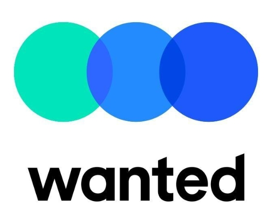

```{r setup, include=FALSE}
knitr::opts_chunk$set(echo = FALSE)
```

### Platinum

### Gold

|     |                                                                                             |     |                                       |     |
|-----|---------------------------------------------------------------------------------------------|-----|---------------------------------------|-----|
|     | [{width="100"}](https://www.r-consortium.org/) |     | {width="100"} |     |

### Silver

### Bronze

|     |                                                  |                                                              |     |     |
|-----|--------------------------------------------------|--------------------------------------------------------------|-----|-----|
|     | {width="100" height="45"} | [{width="100"}](https://www.oss.kr/) |     |     |

### Violet

|     |     |                                                                   |     |     |
|-----|-----|-------------------------------------------------------------------|---------------|-----|
|     |     | [{width="100"}](https://jpub.tistory.com/) |[{width="100"}](https://blog.insightbook.co.kr/)      |     |

### Media & Community

|     |     |                                                                |                                                                              |     |
|-----|-----|----------------------------------------------------------------|------------------------------------------------------------------------------|-----|
|     |     | [{width="100"}](https://www.hani.co.kr/) | [{width="100"}](https://datayanolja.github.io/) |     |

# SNS

-   Global R Meetup: [link](https://benubah.github.io/r-community-explorer/rugs.html)
-   Tidyverse Seoul R Meetup: [link](https://tidyverse-korea.github.io/seoul-R/)
-   Youtube Channel: [link](https://www.youtube.com/channel/UCW-epmIvjBEhhVXw_F0Nqbw)
-   Facebook Group: [link](https://www.facebook.com/groups/tidyverse)
-   **Seoul R Meetup**: [link](https://www.meetup.com/seoul-r-meetup)
-   Shiny Seoul Meetup: [link](https://github.com/shinykorea/Meetup)
