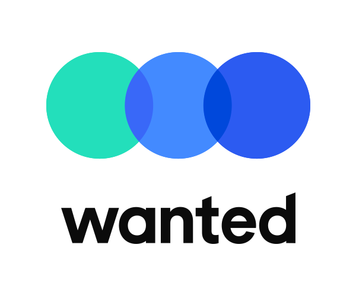

```{r, include=FALSE}
knitr::opts_chunk$set(results = 'asis',
                      echo = FALSE,
                      warning = FALSE,
                      tidy = FALSE,
                      message = FALSE,
                      fig.align = 'center',
                      out.width = "100%")
options(knitr.table.format = "html") 
```

```{r myplot, include=FALSE}
svg('myplot.svg')
plot(iris$Sepal.Length, iris$Sepal.Width)
dev.off()
```

<br> <br>

# 들어가며

디지털 불평등(Digital Divide)과 디지털 경제전환(Digital Transformation)의 가속화가 코로나19로 보다 명확해진 시대다. 이러한 변화의 중심에 빅데이터, 기계학습, 인공지능 등 데이터 기반 기술이 자리 잡고 있으며 또 집중 관심을 받고 있다. 데이터 시대를 맞아 R은 통계에 기반한 프로그래밍 언어임에도 불구하고 다른 범용 프로그래밍 언어와 같은 큰 인기를 얻고 있다.

금번 useR! 2021 Korea 컨퍼런스는 기존 통계학 관련 학계, 산업계, 정부 뿐 아니라 데이터 과학계까지 망라해 데이터를 통해 문제를 해결하고 가치를 창출하고자 하는 모든 분이 모여 경험과 지식을 공유하고 네트워킹을 할 수 있는 자리로 기획하였다. 데이터 활용의 폭과 깊이를 더한 이 자리에서 데이터를 통해 새로운 세상을 열어가고 함께 하실 수 있는 많은 분을 만나는 소중한 시간이 되었으면 하는 바람이다.

<br> <br>

# 키노트 발표

[{width="500"}](https://www.rstudio.com/speakers/julia-silge/) {width="500"}

<br> <br> <br>

# 컨퍼런스 주요 일정

-   2021-07-15 프로그램 발표자 모집 시작
-   2021-09-10 프로그램 발표자 및 발표내용 공개
-   2021-09-17 컨퍼런스 행사 등록 시작
-   2021-05-10 Communicate selected abstracts.
-   2021-11-05 발표하시는 분 동영상, 논문 등 발표자료 송부 마감일
-   2021-11-12 컨퍼런스 등록 마감
-   2021-11-19 컨퍼런스 본 행사

<br> <br>

# 키노트 & 프로그램

+---------------------------+----------------------------------------------+
| 오전                      | 키노트                                       |
+:=========================:+:============================================:+
| Julia Silge               | `tidymodels` & `tidytext`                    |
+---------------------------+----------------------------------------------+
| 미정                      |    미정                                      |  
+---------------------------+----------------------------------------------+

---

+----------------+-----------------------+----------------+---------------+
| 오후           | Session I             | Session II     | Session III   |
+:==============:+:=====================:+:==============:+:=============:+
| 전반           | Reproducible Research | R Meets Python | Deep Learning |
+----------------+-----------------------+----------------+---------------+
| 후반           | Data Journalism       | Visualization  | 자연어처리    |
+----------------+-----------------------+----------------+---------------+

# 함께하시는 분들

Tidyverse Korea

# 후원사

[{width="300"}](https://jpub.tistory.com/) [{width="300"}](https://www.wanted.co.kr/company/79)
